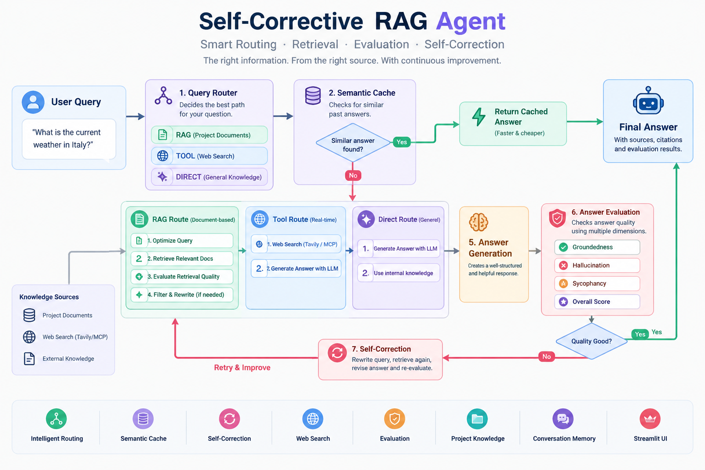

# 🧠 Self-Corrective RAG System with LangGraph

> **Production-oriented Retrieval-Augmented Generation system with intelligent routing, semantic caching, web search, self-correction, evaluation, project-based knowledge management, and a Streamlit interface.**

A modular **Self-Corrective RAG (Retrieval-Augmented Generation)** system designed to answer questions using the right information source while continuously evaluating and improving its responses.

The system combines **LangGraph, LLMs, vector search, semantic caching, web search, answer evaluation, query rewriting, and persistent conversation memory** into a single end-to-end AI application.

---

<!-- <p align="center"> -->

[](https://www.python.org/)
[](https://www.langchain.com/langgraph)
[](https://streamlit.io/)
[](LICENSE)
[](https://github.com/Ahmed2797/self-corrective-rag-langgraph)
[](https://github.com/Ahmed2797/self-corrective-rag-langgraph)

<!-- </p> -->

---



## 🚀 What Problem Does This Solve?

Traditional RAG systems usually follow a simple pipeline:

```text
Question
   ↓
Retrieve Documents
   ↓
Generate Answer
```

This approach can fail when:

* The question does not require document retrieval.
* Retrieved documents are irrelevant.
* The information is outdated.
* The generated answer contains hallucinations.
* The user asks a question requiring real-time web information.
* The original query is poorly formulated.
* The same question is repeatedly asked.
* There is insufficient evidence to support the answer.

This project addresses these problems by introducing **adaptive routing and self-correction**.

---

## 🌟 Key Features

* **Adaptive Retrieval (`decide_retrieval`):** Smartly routes queries to determine whether vector search is required or direct LLM generation is sufficient[cite: 1].
* **Sentence-Level Chunk Refining:** Deconstructs documents into granular sentence units to filter out noise and retain only relevant context.
* **Hallucination Mitigation (`IsSUP` & `revise_answer`):** Checks if generated answers are strictly grounded in context and automatically revises hallucinated claims[cite: 1].
* **Query Reformulation (`rewrite_question`):** Rewrites search queries and re-executes retrieval loops if initial answers fail usefulness checks[cite: 1].
* **Evaluation Suite (`evaluate_answer`):** Scores final answers across **Groundedness**, **Hallucination**, and **Sycophancy** metrics to guarantee a reliability threshold[cite: 1].

---

## 🏗️ Architecture Flow

```bash
                         ┌──────────────────┐
                         │    User Query    │
                         └────────┬─────────┘
                                  │
                                  ▼
                  ┌──────────────────────────────┐
                  │      Semantic Cache Search   │
                  │       OpenAI Embeddings      │
                  │          + Pinecone          │
                  └──────────────┬───────────────┘
                                 │
                    ┌────────────┴────────────┐
                    │                         │
             similarity ≥ 0.90          similarity < 0.90
                    │                         │
                    ▼                         ▼
          ┌─────────────────┐       ┌────────────────────┐
          │   Cache HIT     │       │ decide_retrieval   │
          │                 │       └─────────┬──────────┘
          │ Cached Answer   │                 │
          │ + Evidence      │                 ▼
          │ + Evaluation    │            Need Retrieval?
          └────────┬────────┘              /          \
                   │                    NO              YES
                   │                     │                │
                   │                     ▼                ▼
                   │              generate_direct      Retrieve
                   │                     │                │
                   │                     │                ▼
                   │                     │          is_relevant
                   │                     │             /      \
                   │                     │          YES        NO
                   │                     │           │           │
                   │                     │           ▼           ▼
                   │                     │  generate_from_    rewrite_question
                   │                     │     context           │
                   │                     │                       │
                   │                     │                       ▼
                   │                     │                    Retrieve
                   │                     │                       │
                   │                     │                       ▼
                   │                     │                  is_relevant
                   │                     │
                   │                     └──────────┐
                   │                                │
                   │                                ▼
                   │                         ┌─────────────┐
                   │                         │    is_sup   │
                   │                         └──────┬──────┘
                   │                                │
                   │                    ┌───────────┴───────────┐
                   │                    │                       │
                   │               fully_supported        not supported
                   │                    │                       │
                   │                    ▼                       ▼
                   │                 is_use              revise_answer
                   │                    │                       │
                   │              ┌─────┴─────┐                 │
                   │              │           │                 │
                   │           useful     not_useful            │
                   │              │           │                 │
                   │              ▼           ▼                 │
                   │       evaluate_answer  rewrite_question ◄──┘
                   │              │
                   │              ▼
                   │       ┌─────────────────┐
                   │       │ Quality Checks  │
                   │       │                 │
                   │       │ Hallucination   │
                   │       │ Groundedness    │
                   │       │ Sycophancy      │
                   │       │ Overall Quality │
                   │       └────────┬────────┘
                   │                │
                   │                ▼
                   │       save_semantic_cache
                   │                │
                   └────────────────┘
                                    │
                                    ▼
                                  END


             ┌──────────────────────┐
             │   no_answer_found    │
             │                      │
             │ Max retries reached │
             │ / no relevant docs  │
             └──────────┬───────────┘
                        │
                        ▼
                       END

```

## 🛠️ Tech Stack

* **Orchestration:** LangGraph / LangChain[cite: 1]
* **LLM & Embeddings:** OpenAI (`text-embedding-3-small`, `gpt-4o-mini` / `gpt-4o`)
* **Vector Database:** Pinecone / FAISS
* **Language:** Python 3.10+
* **Deployment:** AWS Cloud deployment, Automated CI/CD

---

### AI / LLM

* Python
* LangChain
* LangGraph
* OpenAI
* Structured LLM outputs
* Prompt engineering

### Retrieval

* Vector embeddings
* Pinecone
* Semantic search
* Retrieval evaluation
* Query optimization
* Query rewriting

### External Tools

* Tavily
* MCP
* Async tool execution

### Backend

* Python
* SQLAlchemy
* SQLite
* Repository pattern
* Service layer

### Frontend

* Streamlit
* Stateful UI
* Streaming pipeline events
* Project / chat management

### Engineering

* Docker
* Git
* Logging
* Exception handling
* Modular architecture
* Async programming

---

## 🧩 LangGraph Workflow

The application is implemented as a stateful LangGraph workflow.

Important nodes include:

| Node                    | Responsibility                       |
| ----------------------- | ------------------------------------ |
| `decide_route`          | Determines RAG / Tool / Direct route |
| `check_semantic_cache`  | Searches previous semantic answers   |
| `optimizer`             | Improves retrieval query             |
| `retrieve`              | Retrieves relevant documents         |
| `check_retrieval_score` | Evaluates retrieval quality          |
| `generate_direct`       | Generates direct LLM answer          |
| `web search tools`      | Uses external tools/web search       |
| `evaluate_answer`       | Evaluates generated answer           |
| `rewrite_question`      | Rewrites poor questions              |
| `revise_answer`         | Corrects weak answers                |

The workflow is designed as a **state machine rather than a fixed linear chain**, allowing the system to make decisions dynamically.

---

## 📊 Evaluation

The system evaluates generated answers using multiple quality signals.

### Groundedness

Measures whether the answer is supported by retrieved context.

### Hallucination

Detects unsupported or fabricated information.

### Sycophancy

Checks whether the model unnecessarily agrees with the user instead of following evidence.

### Overall Evaluation

A combined score can be used to decide whether an answer should be accepted or corrected.

Example conceptual scoring:

```text
Final Score =
    0.4 × Groundedness
  + 0.4 × (1 - Hallucination)
  + 0.2 × (1 - Sycophancy)
```

---

## 🚀 Quick Start

### 1. Prerequisites & Environment Setup

```bash
## Clone the repository and install the dependencies
git clone https://github.com/Ahmed2797/self-corrective-rag-langgraph.git
cd self-corrective-rag-langgraph

pip install -r requirements.txt

## .env & Setup github secrets

PINECONE_API_KEY = ""
OPENAI_API_KEY = "sk-proj-----"
GROQ_API_KEY = ""
TAVILY_API_KEY = "tvly-de"
SERPER_API_KEY = ""

AWS_ACCESS_KEY_ID = ""
AWS_SECRET_ACCESS_KEY = ""
AWS_ECR_LOGIN_URI = "***********.us-east-1.amazonaws.com"
ECR_REPOSITORY_NAME = ''
AWS_REGION = "us-east-1"
AWS_DEFAULT_REGION = "us-east-1"
BUCKET_NAME = ""

```

## ▶️ Run the Application

Start the Streamlit application:

```bash
streamlit run app.py
```

## AWS-CICD-Deployment-with-Github-Actions

### 1. Login to AWS console

### 2. Create IAM user for deployment

``` bash
# with specific access
1. EC2 access : It is virtual machine

2. ECR: Elastic Container registry to save your docker image in aws

#Description: About the deployment

1. Build docker image of the source code

2. Push your docker image to ECR

3. Launch Your EC2 

4. Pull Your image from ECR in EC2

5. Lauch your docker image in EC2

#Policy:

1. AmazonEC2ContainerRegistryFullAccess

2. AmazonEC2FullAccess
```

### 3. Create ECR repo to store/save docker image

* Save the URI: 520551197421.dkr.ecr.us-east-1.amazonaws.com/self-rag

### 4. Create EC2 machine (Ubuntu)

### 5. Open EC2 and Install docker in EC2 Machine

``` bash

#optinal

sudo apt-get update -y

sudo apt-get upgrade

#required

curl -fsSL https://get.docker.com -o get-docker.sh

sudo sh get-docker.sh

sudo usermod -aG docker ubuntu

newgrp docker

```
